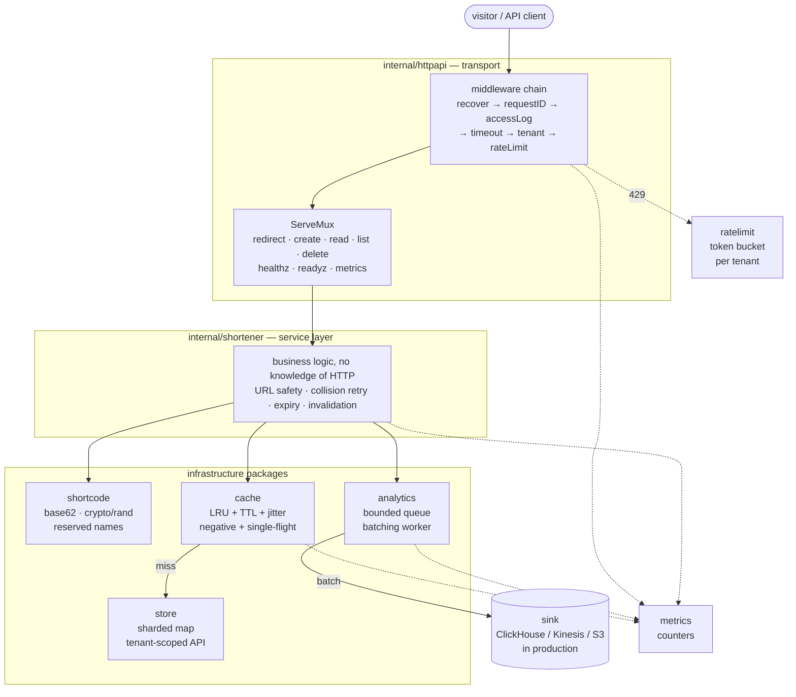
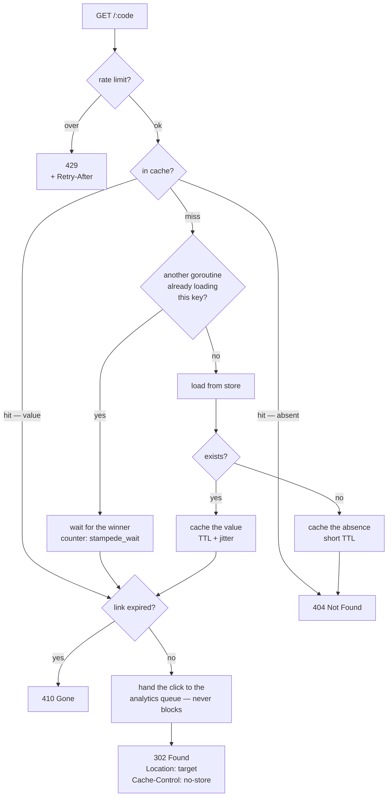
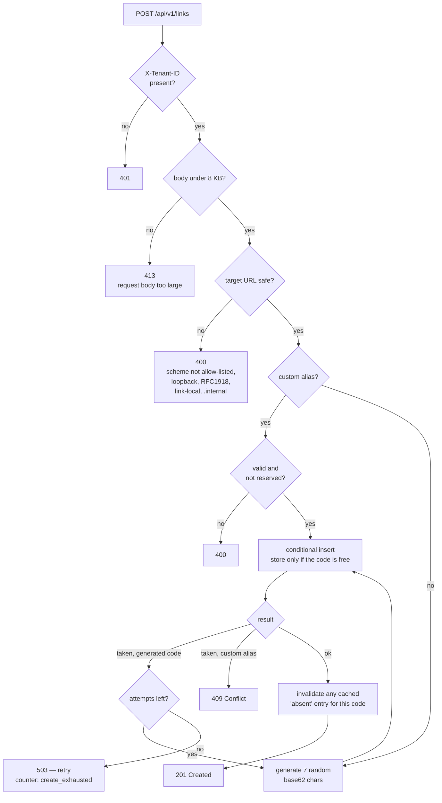
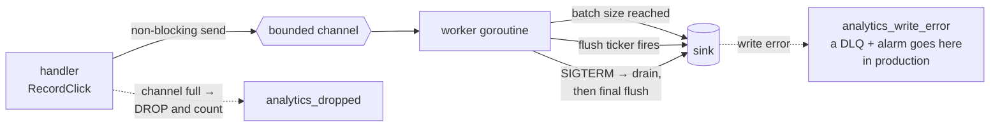
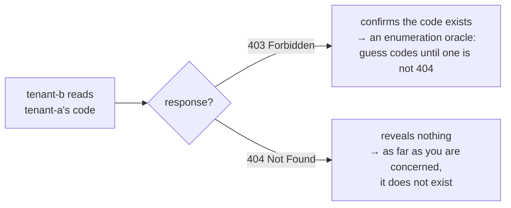
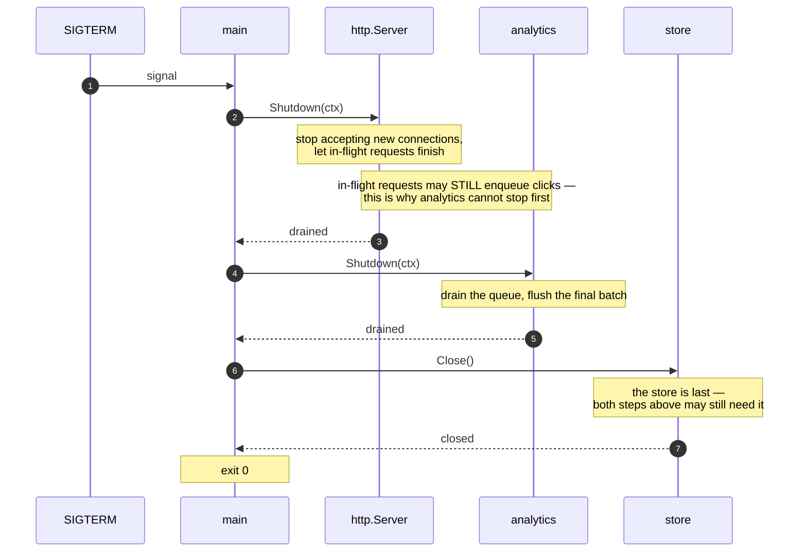

# linkly

A URL shortener in Go, built as a study project for the System Design Primer's
**"Design Pastebin.com / Bit.ly"** exercise.

Standard library only — no external dependencies. The point is not the shortener:
it is making the *reasoning behind every design decision visible in the code*.
Each non-obvious choice carries a bilingual (EN + TR) comment naming the
system-design topic it belongs to and why it matters.

```go
// EN: An unbounded queue is not a safety net, it is a delayed crash: the queue
//     outgrows memory, spills, slows down, and the slowdown makes the queue grow
//     faster. Bounding it forces you to answer the real question — what do we do
//     when we cannot keep up? — instead of pretending it never happens.
// TR: Sınırsız kuyruk bir emniyet ağı değil, ertelenmiş bir çöküştür: ...
// [Topic · Konu: Back pressure]
```

---

## Contents

- [Why this problem](#why-this-problem)
- [Architecture](#architecture)
- [The read path — a redirect](#the-read-path--a-redirect)
- [The write path — creating a link](#the-write-path--creating-a-link)
- [Analytics: work that must never block a request](#analytics-work-that-must-never-block-a-request)
- [Back pressure in four places](#back-pressure-in-four-places)
- [The tenant boundary](#the-tenant-boundary)
- [Shutdown ordering](#shutdown-ordering)
- [Failure modes](#failure-modes)
- [Running it](#running-it)
- [API](#api)
- [Configuration](#configuration)
- [Observability](#observability)
- [What each package demonstrates](#what-each-package-demonstrates)
- [Deliberate simplifications](#deliberate-simplifications)
- [Verification](#verification)

---

## Why this problem

A URL shortener looks trivial. It is not — it packs in most of the topics worth
practising, at a size you can hold in your head:

| Property | Consequence |
|---|---|
| **Read-heavy** — roughly 1 write per 100–1000 reads | Textbook cache-aside; the cache *is* the architecture |
| **Immutable mapping** | Long TTLs are safe, invalidation is rare but must be correct |
| **The short code is four things at once** | Primary key, cache key, shard key **and** part of the security surface |
| **Click analytics** | Work that must never slow down or fail a redirect → asynchronism |
| **Multi-tenant** | Isolation must hold at every layer, and forgetting it produces *no error at all* |
| **Public redirect endpoint** | Anyone can hit it; anyone can put anything in the target URL |

The capacity maths is worth doing once: base62 with 7 characters gives
62⁷ ≈ **3.5 trillion** keys. At 100 new links per second you would need ~1,100
years to fill it. Seven is not a round number — it is the shortest length that
makes collisions statistically irrelevant at this write rate.

---

## Architecture

Three layers plus infrastructure. The layering is not tidiness: cross-cutting
protections (rate limiting, timeouts, panic recovery) live in the middleware
layer, so **every handler inherits them and nobody can forget to add one**. A
protection that depends on each developer remembering it is not a protection.



Dotted lines are observation and admission control — they touch everything but
carry no business data.

**Why `store.Store` is an interface and everything else is concrete:** the store
is the one thing you would genuinely swap (Postgres, DynamoDB, Redis). The cache
and the queue are not pluggable here on purpose — pretending they might be would
add indirection that buys nothing in a study project.

---

## The read path — a redirect

This is the hot path, and everything on it is shaped by one fact: it runs
orders of magnitude more often than anything else.



Five decisions are visible in that one diagram:

**1 · "Absent" is a cacheable answer.** The loader signature is
`(value, found, error)` — three outcomes, not two. A key that genuinely does not
exist gets cached as *absent* with a short TTL. Without this, every lookup of a
non-existent code reaches the store forever (*cache penetration*), and a hostile
client can aim traffic straight at your database by requesting random codes.
Collapsing "empty" and "absent" into one representation is a classic silent
outage: the cache stops working for that key and nothing reports it.

**2 · One loader per key, not one per request.** When a hot key expires under
load, the naive cache lets *every* concurrent request run the same expensive
load. The store saturates, latency grows, and the growing latency delays the
winner that would refill the cache — a self-feeding collapse. Here the first
caller loads and the rest wait on it. The subtle part is the **error** path: if
the load fails, waiters get the error immediately rather than hanging until some
TTL. A guard that deadlocks when its dependency is sick has become the new outage.

**3 · Two different clocks.** The cache TTL says *"how stale may my copy be"*;
the link TTL says *"when does this link stop being valid"*. Expiry is therefore
checked **after** the cache returns, not by evicting early. Conflating them means
either serving dead links or evicting live ones for nothing.

**4 · 302, not 301.** This is the most interesting one-line trade-off in any
shortener — a caching decision disguised as a status code:

| | `301 Moved Permanently` | `302 Found` |
|---|---|---|
| Cached by browsers/proxies | Yes, often for a very long time | No, by default |
| Load on you | Near zero after the first hit | Every click |
| Click analytics | **Go dark** | Preserved |
| Can you change or revoke the target? | Not for anyone who already visited | Yes |

linkly defaults to 302, because for a shortener the click data and revocability
*are* the product. It also sets `Cache-Control: no-store` explicitly — a CDN or
corporate proxy that decides to cache the redirect erases the clicks just as
effectively as a 301, and you would not notice, because the requests simply stop
arriving. **"No data" and "no traffic" look identical on a dashboard.**

**5 · The click is fire-and-forget.** One line, and it is the whole point of the
asynchronism chapter: the redirect does not wait for analytics and cannot be
failed by them.

---

## The write path — creating a link



**Collision detection belongs to the store, not to a pre-flight check.** The
insert is *conditional* — "write only if this key is free" — evaluated inside one
lock acquisition. A read-then-write ("does it exist?" then "insert") has a race
window where two requests both see *free* and both write. A test pins this:
64 concurrent inserts of the same code, exactly 1 winner. In a real store the same
semantics are `attribute_not_exists` in DynamoDB or a `UNIQUE` index in SQL.

**The retry bound is a signal, not a formality.** With 3.5 trillion keys and a
small corpus, one collision is improbable; a second on a fresh random code is
improbable squared. So exhausting the attempts does not mean "unlucky" — it means
*the keyspace is filling up, or something is broken*. An unbounded retry loop
would hide exactly that signal, and would also let one request burn a whole
timeout budget.

**The easiest bug to miss is the last step.** If somebody requested this code
*before* it existed — a probe, a typo, a link shared ahead of creation — the read
path cached an *absent* entry. Without clearing it, the brand-new link 404s until
that TTL expires: a broken link that mysteriously fixes itself later, which is the
worst kind of bug report to receive. This is also why the negative TTL is kept
short — it bounds the blast radius of exactly this race.

---

## Analytics: work that must never block a request



The single most important decision in the package is one line: **when the queue
is full the event is dropped and the drop is counted. It never blocks.**

Why dropping is right *here*: losing a click count is cheap and recoverable — the
curve barely moves. Blocking a user-facing redirect is expensive and visible.
This is a fail-open choice, and the question is never "which is safer" in the
abstract, it is *"what does being wrong cost on **this** path"*.

It also means analytics are **at-most-once** — weak consistency, which is exactly
the level you would assign to metric counters. Had this been billing rather than
analytics, the answer would flip: bound the queue and return 503 upstream. The
code says so where the decision is made.

Batching is **write-behind**: throughput up, freshness down. Columnar stores in
particular hate row-at-a-time inserts — each insert becomes a part and merge cost
explodes. The visible consequence is that a click is not instantly reflected in a
report. That is not a bug; the buffer has not flushed.

`analytics_dropped` is a first-class metric for a reason. **A drop counter nobody
watches is a silent failure with extra steps.**

---

## Back pressure in four places

Back pressure is the answer to *"what happens when we cannot keep up?"* — and the
naive answer ("the queue grows") is wrong. A growing queue outgrows memory, spills
to disk, and the slowdown makes it grow faster. Worse, by accepting work you
cannot do you also break the promise made to work you already accepted.

| # | Where | Mechanism | Why there |
|---|---|---|---|
| 1 | **At the door** | Token bucket per tenant → `429` + `Retry-After` | Cheapest possible place: rejected work consumes no connection, no goroutine, no store round trip |
| 2 | **Queue bound** | Fixed-capacity channel → drop + count | Forces an explicit answer instead of an unbounded queue |
| 3 | **Concurrency bound** | One worker, bounded batch | Unbounded parallelism is the *absence* of back pressure: the system cannot tell itself to slow down, it just allocates until it is OOM-killed |
| 4 | **Timeouts** | Request deadline propagated via `context` | Frees the resource when the answer no longer has a reader |

Two details worth stealing:

**`Retry-After` is protocol, not politeness.** A bare "no" invites a retry storm —
every rejected client comes back immediately and in unison. Telling the client
*when* to return converts a defensive measure into a two-sided agreement.

**Dry-run mode.** `LINKLY_RATE_DRY_RUN=true` makes the limiter count what it
*would* have rejected without rejecting anything. The most expensive mistake in
rate limiting is picking a number that cuts legitimate traffic — and you cannot
learn that number in a design meeting, only from the measured distribution. So a
new limit ships in dry-run, you watch `linkly_ratelimit_would_reject` for a while,
and only then enforce.

---

## The tenant boundary

In a multi-tenant system, a security failure is usually not an attack — it is a
forgotten filter. And the forgotten filter **produces no error**: the query
succeeds, the log is clean, the dashboard is green, and the numbers belong to
somebody else. That is the most dangerous class of bug there is, because an attack
leaves traces and a missing `WHERE` does not.

So the boundary lives in the **method signature**, not in the caller's discipline:

```go
Get(ctx, code)                          // public redirect — deliberately global
GetOwned(ctx, tenantID, code)           // management read — tenant enforced
ListByTenant(ctx, tenantID, limit)      // always scoped
Delete(ctx, tenantID, code)             // ownership re-checked inside the lock
```

The asymmetry is intentional and worth stating out loud: **the redirect path is
not tenant-scoped, because a visitor on the internet has no tenant.** Tenant
checking belongs to the management endpoints — and forgetting it there is exactly
the IDOR bug (authenticated user changes an `id` in the URL and reads somebody
else's record).

For the same reason the cache is keyed by the short code alone, with no tenant
prefix: it caches the *public* mapping. If it also cached tenant-scoped
management reads, the key would have to carry the tenant — otherwise isolation
would be broken *at the cache layer* while the database looked perfectly correct.

One more choice: **a cross-tenant read answers `404`, not `403`.**



When the resource is not yours, the honest answer and the safe answer are the same
one.

---

## Shutdown ordering

`SIGTERM` does not mean "stop now". It means "stop accepting and finish what you
already have". Getting the order wrong loses data — and, critically, **loses it
silently**: no error, no log line, just work that quietly never happened.



**The rule:** every closer must run *before* the closer of the thing it depends on.
Stop accepting → drain what you hold → close dependencies → close stores.

A synchronous service that dies mid-request produces an error the client can see
and retry. An asynchronous consumer that dies holding events produces **nothing**.
That asymmetry is why graceful shutdown is a data-integrity concern in async
systems, not a nicety.

One line in the `Dockerfile` can cancel all of it: `ENTRYPOINT` must be in **exec
form**. In shell form, PID 1 is `/bin/sh`, which does *not* forward `SIGTERM` to
your process — the drain never runs and Docker `SIGKILL`s after the grace period.
Every carefully ordered `Close()` is worth exactly nothing if the signal never
arrives. (`docker stop` on this image exits **0**, not 137 — that is the proof.)

---

## Failure modes

What actually happens when each dependency misbehaves, and why:

| Failure | Behaviour | Rationale |
|---|---|---|
| Cache miss storm on a hot key | One loader runs, the rest wait | Stampede guard; `stampede_wait` counts it |
| Cache **load error** | Waiters get the error at once; the error is **not** cached | Caching a blip turns it into a TTL-long outage for that key |
| Cache memory pressure | LRU eviction, bounded capacity | An unbounded cache is a memory leak with good intentions |
| Many keys written together | TTL jitter spreads their expiry | Otherwise they all expire in the same second and the store sees full load — *cache avalanche* |
| Analytics queue full | Event dropped, `analytics_dropped` incremented | Fail-open: a click is cheap, a blocked redirect is not |
| Analytics sink failing | Batch lost, `analytics_write_error` incremented | Where a DLQ + depth alarm belongs in production |
| Sink hung | Bounded `context` on the write | A stuck dependency must not wedge the worker forever |
| Client floods the service | `429` + `Retry-After` | Shed at the door; tell the client when to return |
| Slow request | Deadline fires; work is cancelled, not just the response | Otherwise the client gives up while you keep burning resources |
| Handler panics | `500` + `http_panic` counter, process survives | Go's default kills the connection and tells you nothing |
| Expired link | `410 Gone`, not `404` | "It existed and is over" is different information; `410` means stop asking |
| Code never existed | `404`, and the absence is cached briefly | Protects the store from repeated lookups of nothing |

---

## Running it

```bash
make run            # local, :8080
make test           # test suite
make race           # race detector
make cover          # coverage summary

make docker         # container image — 15 MB, distroless, non-root
make docker-run     # run the container
make compose        # docker compose, with read-only fs and dropped capabilities

python3 scripts/smoke.py http://localhost:8080   # 49-assertion end-to-end suite
```

`smoke.py` runs against a live instance and checks behaviour, not implementation:
cache hit/miss ratios, negative caching, TTL expiry, tenant isolation, rate
limiting, status-code semantics, metric presence. Each assertion maps to a
specific design decision above.

### Quick tour

```bash
# create
curl -s -X POST localhost:8080/api/v1/links \
  -H 'Content-Type: application/json' \
  -H 'X-Tenant-ID: acme' \
  -d '{"url":"https://example.com/landing"}'

# follow it — note the 302 and the Cache-Control header
curl -i localhost:8080/<code>

# a link that expires in an hour
curl -s -X POST localhost:8080/api/v1/links \
  -H 'Content-Type: application/json' -H 'X-Tenant-ID: acme' \
  -d '{"url":"https://example.com/promo","alias":"promo","ttl":"1h"}'

# tenant-scoped list, and the counters
curl -s localhost:8080/api/v1/links -H 'X-Tenant-ID: acme'
curl -s localhost:8080/metrics
```

---

## API

| Method | Path | Auth | Notes |
|---|---|---|---|
| `POST` | `/api/v1/links` | tenant | Body `{"url", "alias"?, "ttl"?}`. `201` · `400` invalid/unsafe · `409` alias taken · `413` body over 8 KB · `503` keyspace exhausted |
| `GET` | `/:code` | none | Public redirect. `302` · `404` unknown · `410` expired |
| `GET` | `/api/v1/links` | tenant | Scoped list, `?limit=` up to 500 |
| `GET` | `/api/v1/links/:code` | tenant | Scoped read. `404` when not yours |
| `DELETE` | `/api/v1/links/:code` | tenant | `204`. `404` when not yours |
| `GET` | `/healthz` | none | Liveness — process is alive |
| `GET` | `/readyz` | none | Readiness — safe to route traffic |
| `GET` | `/metrics` | none | Prometheus text format |

**Liveness and readiness answer different questions and must not share an
implementation.** Liveness failing means *restart me*; readiness failing means
*stop sending me traffic, but I am fine*. Wiring a dependency check into liveness
is a classic self-inflicted outage: the dependency blips, every replica reports
unhealthy, the orchestrator restarts the whole fleet at once, and now there is a
cold-cache stampede on top of an already sick dependency.

---

## Configuration

Everything is environment-driven. Every default in `internal/config/config.go`
carries the reasoning for its value.

| Variable | Default | What it controls |
|---|---|---|
| `LINKLY_ADDR` | `:8080` | Listen address |
| `LINKLY_BASE_URL` | `http://localhost:8080` | Prefix used to render `short_url` |
| `LINKLY_CODE_LENGTH` | `7` | Short-code length — see the capacity maths |
| `LINKLY_MAX_ATTEMPTS` | `5` | Collision retries before `503` |
| `LINKLY_SHARDS` | `16` | Store shard count |
| `LINKLY_CACHE_SIZE` | `10000` | LRU capacity |
| `LINKLY_CACHE_TTL` | `5m` | Positive entry lifetime |
| `LINKLY_CACHE_NEG_TTL` | `10s` | "Absent" entry lifetime — short on purpose |
| `LINKLY_CACHE_JITTER` | `0.2` | Expiry spread, as a fraction of TTL |
| `LINKLY_RATE_PER_SEC` | `50` | Token refill rate |
| `LINKLY_RATE_BURST` | `100` | Bucket size |
| `LINKLY_RATE_DRY_RUN` | `false` | Count rejections without enforcing |
| `LINKLY_ANALYTICS_QUEUE` | `4096` | The queue bound — *this number is the back-pressure policy* |
| `LINKLY_ANALYTICS_BATCH` | `128` | Batch size before a flush |
| `LINKLY_ANALYTICS_FLUSH` | `1s` | Time-based flush — a latency ceiling for a batch's tail |
| `LINKLY_REQUEST_TIMEOUT` | `3s` | Per-request deadline |
| `LINKLY_SHUTDOWN_TIMEOUT` | `15s` | Drain budget — keep it *below* the orchestrator's grace period |
| `LINKLY_PERMANENT_REDIRECT` | `false` | `true` switches 302 → 301 |

A TTL, a queue size and a rate limit are **contracts** with the rest of the
system, and contracts must be readable and changeable without a deploy. A 30-day
TTL written as `time.Hour*24*30` detonates silently exactly 30 days after go-live,
on a day nobody changed anything — which makes it the hardest kind of incident to
diagnose.

---

## Observability

Every counter is pre-registered at zero on startup. That is not cosmetic: a
counter that only appears the first time it fires **cannot be alerted on**,
because the monitoring system cannot distinguish *"this never happened"* from
*"this endpoint is not reporting"*.

| Counter group | Names | What it tells you |
|---|---|---|
| HTTP | `http_requests_total`, `http_status_{2,3,4,5}xx`, `http_panic` | Traffic shape and crashes |
| Redirect | `redirect_ok`, `redirect_not_found`, `redirect_gone` | Product health |
| Create | `create_ok`, `create_collision`, `create_exhausted` | Keyspace pressure |
| Cache | `cache_hit`, `cache_negative_hit`, `cache_miss`, `cache_stampede_wait`, `cache_expired`, `cache_eviction`, `cache_invalidate`, `cache_load_error` | Whether the cache is doing its job — and whether its guards still work |
| Rate limit | `ratelimit_allow`, `ratelimit_reject`, `ratelimit_would_reject` | Enforcement and dry-run calibration |
| Analytics | `analytics_enqueued`, `analytics_dropped`, `analytics_written`, `analytics_write_error` | Whether the async path is keeping up |

Two of these deserve attention because they are the ones that catch *silent*
regressions:

- `cache_stampede_wait` rising is **not** an error — it is proof the guard is
  working. You cannot see that from hit ratio alone.
- `cache_load_error` climbing means writes back into the cache are failing, which
  silently degrades the stampede guard into "recompute on every request". The
  cache still looks present; it just stops protecting anything.

---

## What each package demonstrates

| Package | Topic | Why it is here |
|---|---|---|
| `shortcode` | Key design, security | Base62 keyspace maths. `crypto/rand` over a sequential counter — the rejected alternative is kept in-tree with its trade-off spelled out, because a choice is only visible next to what it rejected. Reserved names that cannot shadow real routes |
| `store` | Multi-tenancy, atomicity | Tenant boundary in the signature; conditional insert instead of read-then-write; sharded map makes lock contention visible at a readable scale |
| `cache` | The whole caching chapter | Cache-aside, LRU, TTL + jitter, negative caching, single-flight. `Loader` returns `(value, found, error)` so "empty" and "absent" never collapse |
| `analytics` | Asynchronism, back pressure | Bounded channel → worker → batch → sink; drops rather than blocks; drains on shutdown |
| `ratelimit` | Back pressure at the door | Token bucket, per-tenant key, `Retry-After`, dry-run calibration, bucket GC so the limiter cannot leak memory |
| `httpapi` | Communication, authorization | Middleware order as a design decision; 302-vs-301; `404` instead of `403`; the four server timeouts Go leaves unset by default |
| `shortener` | Service layer | Business logic with no HTTP knowledge; URL safety validation; negative-cache invalidation; delete ordering |
| `metrics` | Observability | Pre-registered counters — the difference between an alertable metric and a blind spot |
| `cmd/linkly` | Graceful shutdown | Stop accepting → drain → close stores |
| `Dockerfile` | Least privilege | Multi-stage, distroless, non-root, exec-form `ENTRYPOINT`, self-probing healthcheck |

### Five places worth reading first

1. **`cache.Loader`'s signature** — three outcomes, not two.
2. **The error path in `cache.GetOrLoad`** — the guard's own failure mode.
3. **`shortener.afterCreate`** — one line, and the bug it prevents is invisible until it isn't.
4. **`store.Memory.GetOwned`** — four lines and the entire IDOR lesson.
5. **The last 20 lines of `main.go`** — shutdown ordering.

---

## Deliberate simplifications

Being explicit about what this is *not*, because knowing the limits of a design
is worth as much as the design:

- **The store is in-memory.** `store.Store` is kept deliberately narrow so
  swapping in a real backend is one implementation. `CreateUnique`'s conditional
  semantics map directly onto DynamoDB's `attribute_not_exists` and SQL's `UNIQUE`.
- **`X-Tenant-ID` is a plain header, and it is NOT authentication.** Anyone can
  send it with curl. It exists so the tenant-boundary logic — the part worth
  studying — can be demonstrated and tested without dragging an identity provider
  into a teaching project. In production the tenant must be derived from a
  validated token, or injected by a gateway that already authenticated the user.
  `internal/httpapi/middleware.go` says this in capitals.
- **The cache is single-process.** With more than one replica, `Invalidate` stops
  being a local map delete and becomes a **broadcast** problem — pub/sub or a
  durable stream. The moment you keep a copy in each pod's memory you have taken
  on a debt for an invalidation channel; if you do not build it, the interest is
  paid as user-visible inconsistency.
- **Analytics are at-most-once.** A full queue drops clicks. Correct for counters,
  wrong for billing.
- **`ListByTenant` scans every shard.** A real store would keep a secondary index
  keyed by tenant. This is exactly the shortcut that becomes an incident once the
  dataset grows — the code says so where it happens.
- **URL safety is a reduction of risk, not an elimination.** A hostname check does
  not stop DNS names that resolve to private addresses, decimal-encoded IPs, or
  redirect chains. linkly never fetches the target itself, so this is not classic
  SSRF — the risk is a trusted-looking short link pointing a *browser*, possibly
  one inside a corporate network, at an internal address.

---

## Verification

```
go test ./...        53 tests passing, 71.3% statement coverage
go test -race ./...  clean
go vet ./...         clean
scripts/smoke.py     49/49 against the local binary, docker run and docker compose
image                15.2 MB · distroless · UID 65532
docker stop          exit code 0, not 137 — the drain actually happens
```

The tests assert behaviour rather than implementation, and several encode a
specific failure they exist to prevent — 64 concurrent inserts producing exactly
one winner, 50 concurrent misses producing exactly one load, a stampede waiter
that must not hang when the loader errors, an empty string that must be cached as
a *value* rather than as an absence.

---

## Licence

MIT
